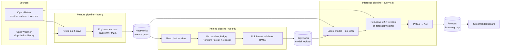

# AQI Forecast

**72-hour hourly PM2.5 and US-EPA AQI forecasts for Delhi, with feature, training and inference pipelines that run on a schedule without manual steps.**

Built during the 10Pearls Data Science internship (2026). Hopsworks serves as the feature store and model registry, GitHub Actions as the scheduler, and Streamlit as the dashboard. Every pipeline falls back to local Parquet/joblib files when Hopsworks isn't configured, so the project runs offline too.

---

## Results

<!-- RESULTS: run `python evaluate_backtest.py` and paste the table it prints here, plus the period line. -->

**How this is measured:** a rolling-origin backtest that mirrors production (`evaluate_backtest.py`).
- Models are trained on the first 80% of the history.
- Across the held-out 20%, a 72-hour forecast is started every 24 hours with the same recursive forecaster the inference pipeline uses, and each hour is compared with the observed PM2.5.
- Two naive baselines are scored the same way: the last observed hour held flat, and the last 24 hours repeated.

**Caveat:** observed weather stands in for the weather forecast, so these errors are a lower bound; in production, weather-forecast error adds to them.

---

## Architecture



| Pipeline | Schedule | Script | Output |
|---|---|---|---|
| Backfill | Manual (`backfill.yml`) | `feature_pipeline.py --days 365` | One year of hourly features |
| Features | Hourly | `feature_pipeline.py --days 5` | Upserts the latest hours (primary key: `time`) |
| Training | Weekly, Sunday 00:00 UTC | `training_pipeline.py` | New registry version + comparison report |
| Inference | Every 6 hours | `inference_pipeline.py` | 72 hourly PM2.5/AQI rows |

---

## Data

| Source | Variables | Window |
|---|---|---|
| Open-Meteo archive | Temperature, relative humidity, pressure, wind speed and direction | 1 year, fetched in 15-day chunks |
| OpenWeather air-pollution history | PM2.5, PM10, CO, NO₂, SO₂, O₃ | 1 year (needs an API key) |
| Open-Meteo air quality (fallback) | Same pollutants | About 92 days |
| Open-Meteo forecast | Same weather variables | Next 72 hours |

Target: hourly PM2.5 (µg/m³) at 28.61° N, 77.21° E. AQI is derived from the PM2.5 forecast with the US-EPA breakpoints.

---

## Features

Every model input at hour *t* is something known when the forecast for hour *t* is made: the weather at *t* (from the forecast) and pollution up to *t − 1*.

| Group | Features |
|---|---|
| Calendar | Hour, day, month, day of week, weekend flag; sine/cosine of hour and month |
| Weather at *t* | Temperature, humidity, pressure, wind speed, wind direction |
| Lags | PM2.5, PM10 and temperature at 1, 3, 6, 12, 24, 48 and 72 hours |
| Rolling | Mean and standard deviation of PM2.5 over the previous 24, 48 and 72 hours |
| Interactions | PM10/PM2.5 ratio (previous hour), temperature × humidity, wind speed × previous-hour PM2.5 |

Same-hour pollutant readings (PM10, CO, NO₂, SO₂, O₃) stay in the feature group but are not model inputs, because they are unknown for future hours.

`tests/test_features.py` enforces both rules:
- Changing PM2.5 at hour *t* must not change any input at hour *t*.
- The inference pipeline's feature builder must produce the same values as the training feature pipeline.

---

## Models

| Model | Configuration |
|---|---|
| Persistence baseline | Previous hour's PM2.5 |
| Ridge | Standardized inputs, α = 1.0 |
| Random Forest | 350 trees, min 2 samples per leaf |
| XGBoost | 500 trees, depth 8, learning rate 0.05, 0.8 row and column subsampling |

The training pipeline splits the history chronologically (80/20, no shuffling) and registers the model with the lowest one-step validation RMSE. It also writes feature importances and a SHAP summary for the XGBoost model.

**Recursive forecasting:** each hour's prediction becomes the lag-1 input for the next hour, so errors compound with horizon. That's why the Results table reports error by horizon instead of a single one-step score.

---

## Design notes

- **Leakage fix (feature group v2).** In the first version, the rolling windows and two interaction features included PM2.5 at the hour being predicted, and same-hour pollutant readings were model inputs. Validation scores looked far better than the model could achieve when forecasting, and at inference those inputs had to be approximated. v2 builds every pollution feature from past hours only, and adds the two tests above. Scores from v1 aren't comparable with v2.
- **Why recursive instead of one model per horizon:** a single model and a single feature definition keep the training and serving code identical. The cost is compounding error at long horizons, which the backtest measures.
- **Local fallbacks:** every Hopsworks call degrades to a local file, which made debugging the scheduled jobs possible without the cloud project.

---

## Run locally

Requires Python 3.10+.

```bash
pip install -r requirements.txt
cp .env.example .env                       # Hopsworks and OpenWeather keys; both optional

python feature_pipeline.py --days 365      # backfill (needs OPENWEATHER_API_KEY for a full year)
python training_pipeline.py                # compare models, register the best one
python evaluate_backtest.py                # 72-hour backtest → evaluation/*.csv
python inference_pipeline.py               # 72-hour forecast → forecast_72h.csv
streamlit run app.py                       # dashboard
python -m pytest                           # leakage and parity tests (no network)
```

Without an OpenWeather key, set `POLLUTION_HISTORY_SOURCE=openmeteo` for a backfill of about 92 days. Without Hopsworks credentials, every step reads and writes local files under `data/`, `models/` and `reports/`.

### Configuration

| Variable | Purpose |
|---|---|
| `HOPSWORKS_API_KEY`, `HOPSWORKS_HOST`, `HOPSWORKS_PROJECT` | Feature store and model registry; leave unset for local mode |
| `HOPSWORKS_FEATURE_GROUP_VERSION`, `HOPSWORKS_FEATURE_VIEW_VERSION` | Default 2 (past-only features) |
| `OPENWEATHER_API_KEY` | One-year pollution backfill |
| `POLLUTION_HISTORY_SOURCE` | `openweather` (default) or `openmeteo` |
| `FORECAST_HORIZON_HOURS` | Default 72 |

In GitHub Actions, the workflows read these from repository variables first and fall back to secrets.

---

## Project structure

```
config.py               # location, feature settings, Hopsworks names, paths
data_sources.py         # Open-Meteo / OpenWeather clients with retry and chunking
feature_pipeline.py     # backfill + feature engineering + feature-group publish
training_pipeline.py    # model comparison, SHAP, registry publish
inference_pipeline.py   # shared feature-row builder + recursive 72-h forecast
evaluate_backtest.py    # rolling-origin backtest against naive baselines
hopsworks_client.py     # feature store / registry helpers with local fallbacks
app.py                  # Streamlit dashboard
tests/                  # leakage and train/serve parity tests
.github/workflows/      # backfill, feature, training, inference, tests
```

---

## Limitations

- **One location.** Delhi only; the coordinates are set in `config.py`.
- **Future PM10 is held at its recent mean.** During the forecast, PM10 lags past the first hour use that mean, not a forecast.
- **Model selection uses one-step RMSE,** while the product is a 72-hour forecast; the backtest is the better selection signal.
- **The backtest uses observed weather,** so it understates production error.
